# SQL pratice

### As I explored relational databases and SQL, I realized how they're like the backstage organizers of data, keeping everything neat and tidy. 

### Learning SQL gave me the keys to unlock common commands and techniques for querying databases effortlessly. ##The SQL Database Tutorial for Beginners was my go-to guide, breaking down SQL and databases in a way that just clicked. 

### With hands-on practice from SQL Bolt tutorials, especially diving into SQL Queries and Database Management, I got really good at visualizing and pulling out the info I needed from databases. Now, I feel ready to dive into real-world database tasks.

#### screenshots of Lessons 1 through 6 - SQL Queries:
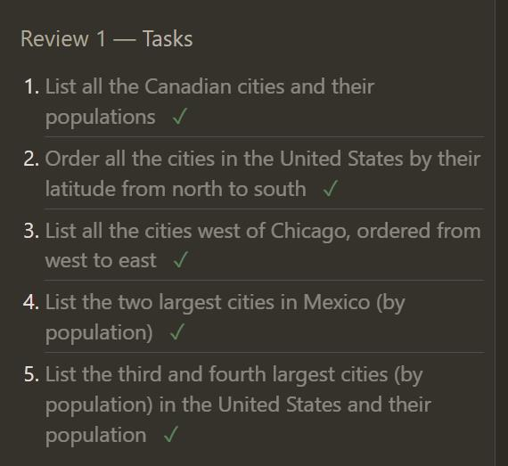 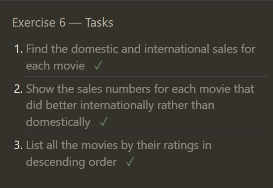 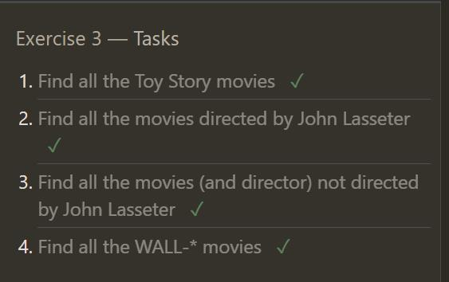 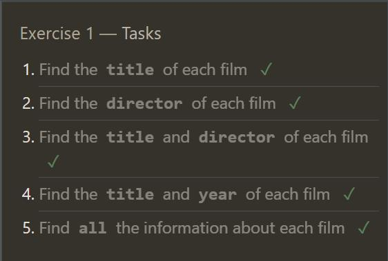 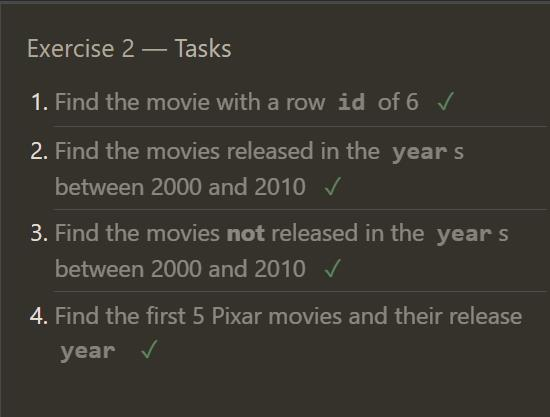 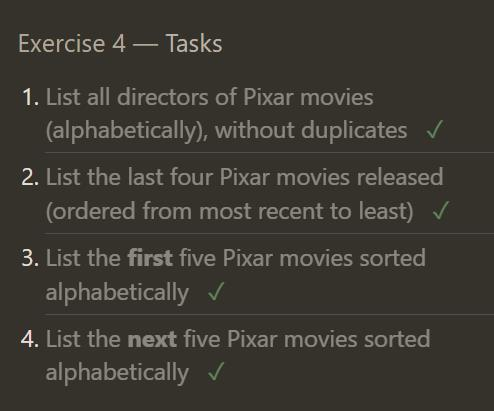

### screenshots of Lessons 13 through 18 - Database Management:
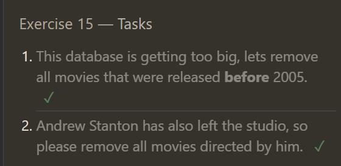 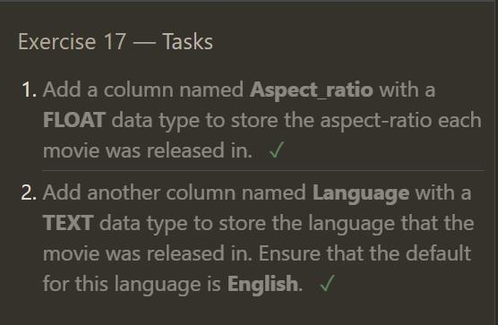 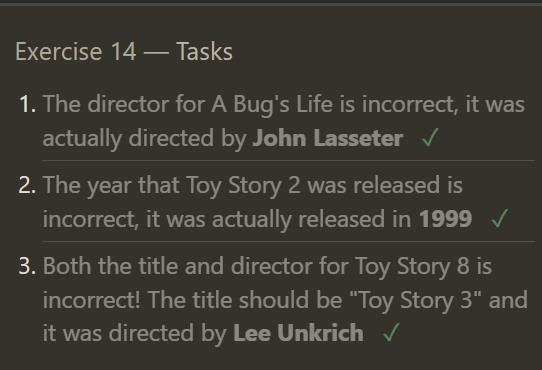 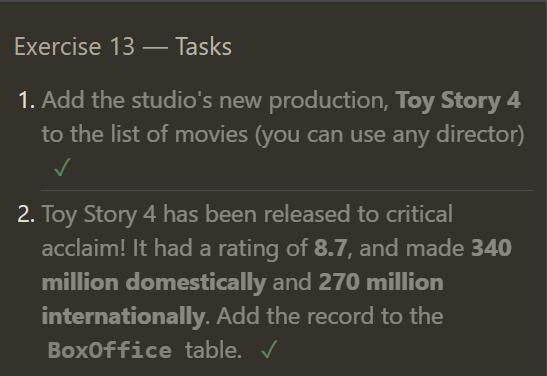 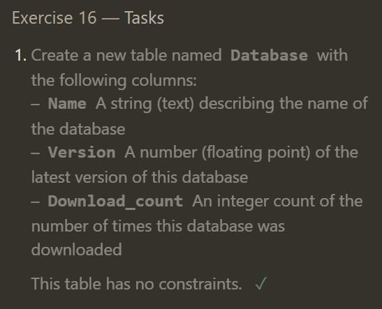 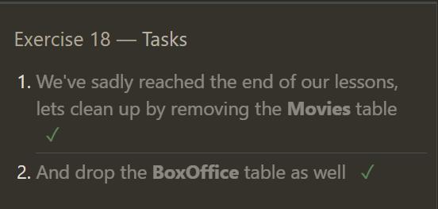